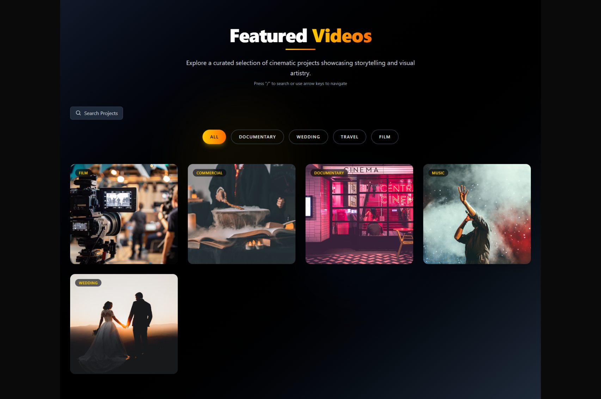
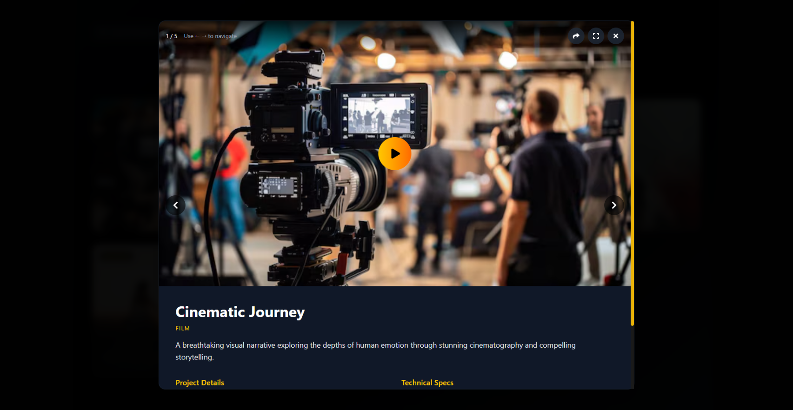

# 📽️ Video Gallery Player

A sleek, modern, and responsive video gallery player built with **React**, **Framer Motion**, and **Tailwind CSS**.

## ✨ Features

* 🎥 Responsive video gallery with **lazy loading**
* 🎨 Smooth **animations and transitions**
* 🔍 **Category-based filtering & Search** for easy browsing
* ⌨️ **Keyboard navigation** support
* 📱 Fully **mobile-friendly** design
* 🖼️ **Fallback images** for broken or missing thumbnails
* ♿ **Accessibility**-friendly interactions




## 🚀 Quick Start

```bash
# Install dependencies
npm install

# Start development server
npm run dev
```

## ⚙️ Performance Optimizations

* Efficient **lazy loading** of images and iframes
* Lightweight and **optimized animations**
* Responsive **image sizing** for all devices
* Robust **error handling** for media loading failures

---

> 💡 Need this video gallery player in another tech stack or framework?
> **Feel free to contact me — I’d be happy to help!**

---

Mail: dev@devplus.fun
